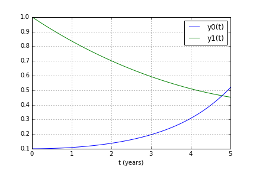
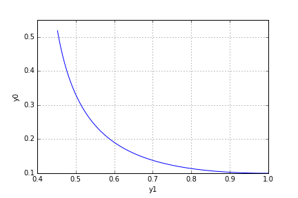
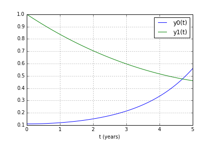
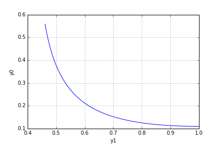

UECM3033 Assignment #3 Report
========================================================

- Prepared by: ** Put your name here**
- Tutorial Group: T2/T3

--------------------------------------------------------

## Task 1 --  Gauss-Legendre formula

The reports, codes and supporting documents are to be uploaded to Github at: 

[https://github.com/AlferdFoo/UECM3033_assign3](https://github.com/AlferdFoo/UECM3033_assign3)

Explain how you implement your `task1.py` here.

Using the numpy.polynomial.legendre.leggauss(deg) to return the node and weight for each node.After that transfer the default domain [-1,1] to new domain [a,b].

Explain how you get the weights and nodes used in the Gauss-Legendre quadrature.

Weight and nodes can be obtained by numpy.polynomial.legendre.leggauss(deg) where 'deg' is the number of nodes.

---------------------------------------------------------

## Task 2 -- Predator-prey model

Explain how you implement your `task2.py` here, especially how to use `odeint`.

The ODE and initial state defined and pass into 'odeint' function. odeint(func, y0, t, args=(a,b)), where func is a function definition, y0 is the initial state, t is the time points and args is extra arguments to pass into function.

Put your graphs here and explain.

With the initial condition of y0_0 = 0.1 and y1_0 = 1.0;
Graph of y0 and y1 against t

Observe that the number of y0 is increasing while the number of y1 is decreasing over these 5 years period.

Graph of y0 against y1

Is the system of ODE sensitive to initial condition? Explain.

Now, by changing the initial condition of y0_0 where slightly increase from 0.1 to 0.11;
Graph of y0 and y1 against t

Graph of y0 against y1;

Thus, we can see that the system is not sensitive to initial condition as the pattern of graph remains.
-----------------------------------

last modified: 17/4/2016
